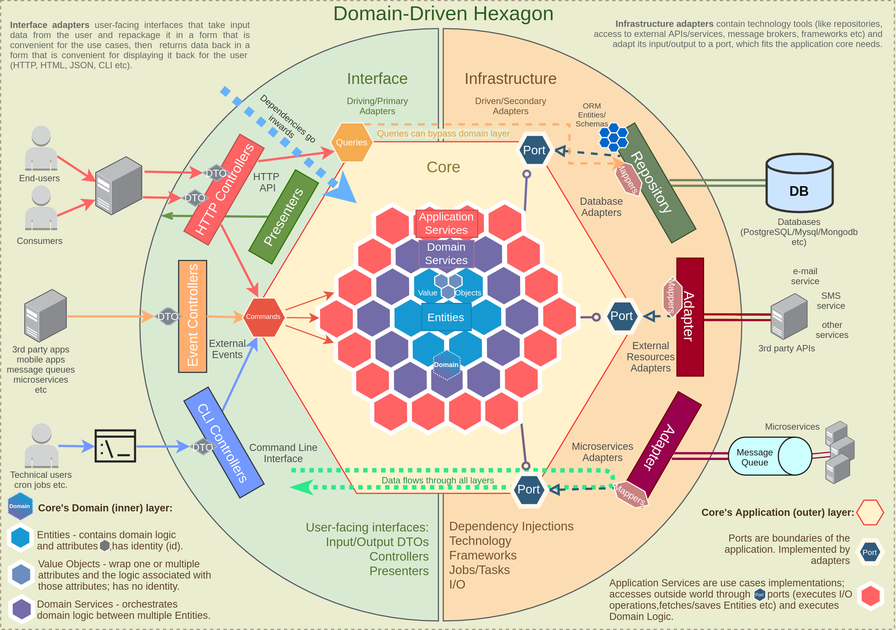

# Base Architecture Pattern

* **Status:** accepted
* **Deciders:** [delucca](https://github.com/delucca/)
* **Date:** 2021-06-21

## Context and Problem Statement

While creating an application, it is critical to have clear boundaries. Having those helps our code to be clean and organized. It is important to have a clear statement for each module, knowing their reason to exist by following the Common-Closure Principle. In this ADR, we're going to define our architecture pattern, as well as how we're going to organize our code.

## Decision Drivers <!-- optional -->

* Easy to understand
* Easy to extend
* Follow the Common-Closure Principle

## Considered Options

1. Hexagonal Architecture
2. Domain-Driven Design

## Decision Outcome

As an outcome of this ADR, I've decided to merge both patterns. I've seen a [few attempts](https://github.com/Sairyss/domain-driven-hexagon) to merge them, but also the Clean Architecture book gives us a pretty good highlight of a proper architecture that follows the CCP principle. To achieve the expected architecture, we must keep in mind both of the following diagrams:

**Domain-Driven Hexagon**

**Clean Architecture**

In a nutshell, both diagrams are organized into layers, following the DIP. So, the outermost layers depends on the innermost, where the inner layers know nothing regarding the outside world.

I've already implemented this pattern in a few projects, and the result is a pretty reliable model that can be easily extended.

### Positive Consequences <!-- optional -->

* It should be extremely easy to add new features
* Our layers will have extremely clear boundaries
* Automated testing should be way easier

### Negative Consequences <!-- optional -->

* That is not a trivial architecture. Junior developers can suffer to understand it
* Some trivial tasks are usually harder to code in this architecture
