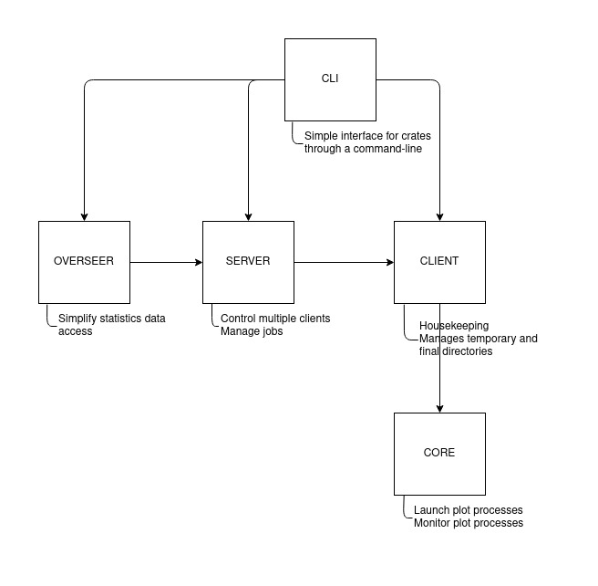

# Crates Relationship

* **Status:** accepted
* **Deciders:** [delucca](https://github.com/delucca/)
* **Date:** 2021-06-21

## Context and Problem Statement

To design a proper scalable, easy to maintain, and reliable tool, we must rely on a proper module structure. We should create a module architecture that follows the SRP by merging features that are common, and separating tasks based on the usage of our tool. In this ADR, we're going to propose an architecture that match those requirements.

## Decision Drivers <!-- optional -->

* Flexible
* Intuitive
* Modular

## Decision Outcome

After further inspection, we decided to use the following structure in our tool:

In this architecture we have 5 main crates, they are:

* **CLI:** Provides a command-line interface to use our tool
* **Overseer:** Provides a simple way to fetch analytics data from our processes
* **Server:** Controls all our clients and manage their jobs
* **Client:** Responsible for keeping a given rig clean and managing its storages (both temporary and final)
* **Core:** Launches and manages plot processes

By following this architecture, we have a clear boundary between the main tasks of a plot manager. It is important to note that all crates will follow an event driven architecture, where they can dispatch events that would be listened by other crates to hook the desired side effects. Also, it is extremelly important to keep the interface simple. So, the CLI should be intelligent enough to handle scenarios where both `server` and `client` are on the same machine.

All crates should be independent, since we're aiming to make easy for other developers to integrate with our tools. Based on this, each crate should have their own integration interface. Completely decoupled from others.
